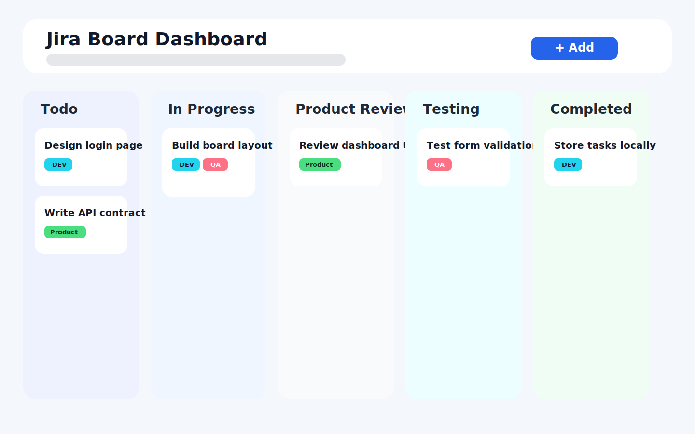
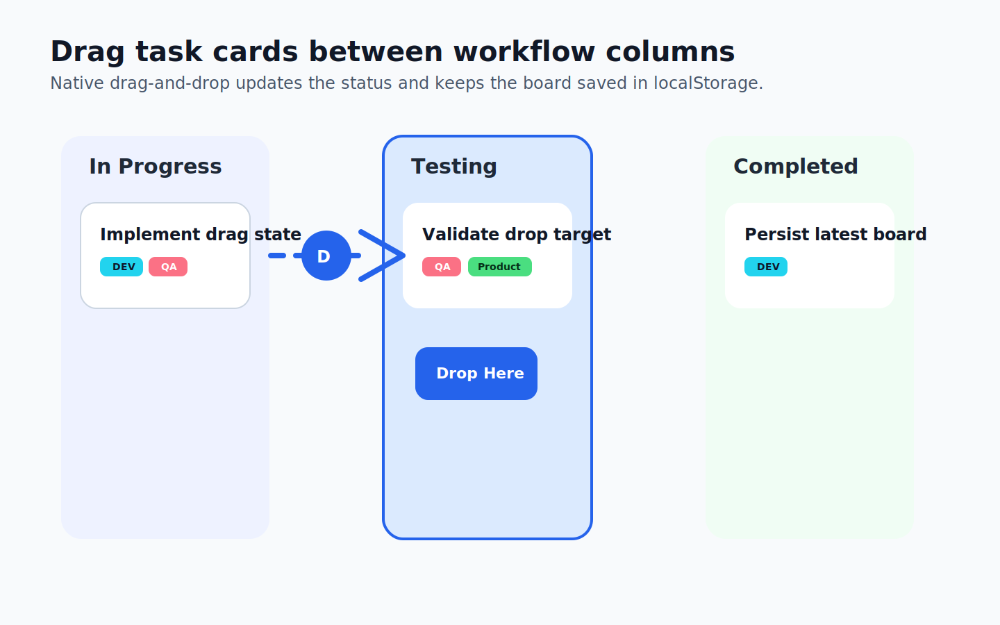

# Jira Board Dashboard

A clean Kanban-style task management dashboard built with React, TypeScript, and Vite. The app lets you create tasks, assign tags, organize work by status, delete tasks, and move cards across columns with drag-and-drop.

## Project Preview



## Screenshots

### Board Overview


### Drag And Drop Flow



## Features

- Create tasks with a title, status, and team tags
- Organize tasks across `Todo`, `In Progress`, `Product Review`, `Testing`, and `Completed`
- Drag task cards between columns to update workflow status
- Delete tasks instantly from any column
- Persist tasks in `localStorage` so the board stays saved after refresh
- Show toast notifications for validation errors
- Responsive layout that works on desktop and smaller screens

## Tech Stack

- React 19
- TypeScript
- Vite
- CSS
- React Hot Toast

## Getting Started

### Prerequisites

- Node.js 18 or newer
- npm

### Installation

```bash
npm install
```

### Run Locally

```bash
npm run dev
```

Open the local URL shown in the terminal, usually `http://localhost:5173`.

### Production Build

```bash
npm run build
```

### Preview Production Build

```bash
npm run preview
```

## How It Works

### Task Creation

Users can add a task title, choose the workflow status, and attach relevant tags such as `DEV`, `QA`, and `Product Owner`.

### Task Board

Tasks are grouped into workflow columns:

- `Todo`
- `In Progress`
- `Product Review`
- `Testing`
- `Completed`

### Drag And Drop

Each task card is draggable. When a card is dropped into another column, its status updates immediately and the latest board state is saved to `localStorage`.

### Persistence

The app reads tasks from `localStorage` on load and writes updated tasks whenever a task is added, moved, or deleted.

## Project Structure

```text
src/
  App.tsx
  todoInterfaces.ts
  components/
    TaskForm/
    TaskCard/
    common/
      Tags/
      TaskColumn/
```

## Available Scripts

- `npm run dev` starts the development server
- `npm run build` creates the production build
- `npm run preview` previews the production build locally

## Future Improvements

- Reorder tasks inside the same column
- Add edit functionality for existing tasks
- Add due dates, assignees, and priority labels
- Connect the board to a backend API

## Author

Built as a React practice project for a Jira-style board workflow.
